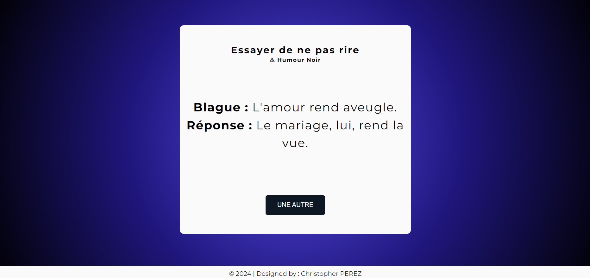
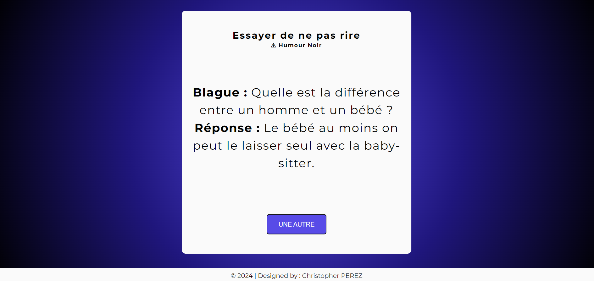

# :flower_playing_cards: Dark Humor

Ce projet est une application interactive qui permet d'afficher des blagues aléatoires à l'aide d'un bouton. Chaque fois que l'utilisateur clique sur le bouton, une nouvelle blague est récupérée depuis une API et affichée, accompagnée de sa réponse.
Il a été réalisé dans le cadre d'une formation sur [Udemy](https://www.udemy.com/course/50-projects-50-days/).

## Fonctionnalités

- **Affichage dynamique des blagues** : Chaque clic sur le bouton déclenche une requête à l'API Blagues API, et une nouvelle blague est affichée.
- **Gestion des catégories de blagues** : Certaines blagues peuvent être filtrées en fonction de leur catégorie.
- **Design responsive** : Le layout s'ajuste automatiquement pour offrir une expérience utilisateur optimale sur différents types d'écrans.

### Technologies Utilisées

#### Structure du projet

Ce projet est le dixième d'une série dans laquelle je me donne l'objectif de perfectionner mes compétences en JavaScript.

Ce projet a été conçu pour mettre en pratique l'utilisation des APIs avec JavaScript, ainsi que la gestion d'événements asynchrones avec fetch et async/await.

- **index.html** : Contient la structure principale de l'application, avec un espace pour afficher les blagues et un bouton pour en générer de nouvelles.
- **style.css** : Gère le style et la mise en page de l'interface, en s'assurant que le design est propre et responsive.
- **script.js** : Contient la logique JavaScript pour interagir avec l'API Blagues API, récupérer des blagues, et les afficher sur la page.
- **blagues.js** : Gère la logique côté serveur (si souhaiter), incluant la gestion des catégories de blagues et la récupération via une API avec des filtres.

##### Mentions Légales ©

Ce projet utilise Blagues API pour récupérer des blagues en français. Toutes les blagues affichées dans cette application sont fournies par **Blagues API**, ce contenu appartient à leurs auteurs respectifs et à la communauté qui contribue à l'API. Pour utiliser l'API, un token d'authentification est nécessaire.

